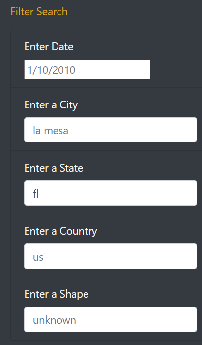
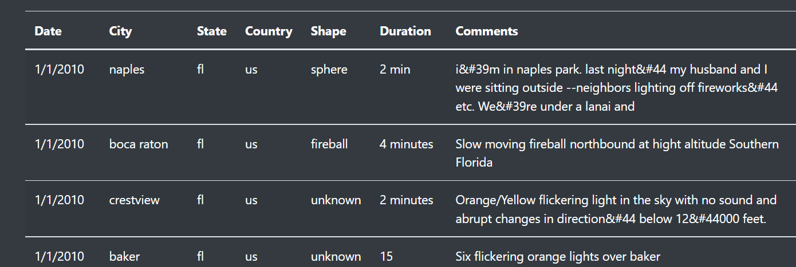

# UFOs
## Overview of Project:
  We had created webpage which provided information on UFOs; but as the topic is interesting and mysterious in itself we decided to have more in depth knowledge of analysis of UFOs sightings by allowing users to filter for multiple criteria where they can searchby city, state, country and shape.
## Results: 
    For this analysis we made changes to HTML code so that anyone who vistis the site would be able to view by entering search criteria as seen below.As we have 5 different filters that a viewer can use.

    But the upper end of page hold information on UFo which inspires a reader to read further.

    With colorful alphabets it makes the page look vibrant. Filters are a great way to look for information because the filters helps one to get information even if one search field is populated with information.

## Summary:
   Altogether it is a great project to work for javascript and HTML but there is a drawback that there is not enough data. We can include data which can tell us how many people saw UFO. 
   So, the recommendations can be that more data to be included and second one is although some information might have been updated in the site but it would be good to have constant updation of the site, to provide new information.
